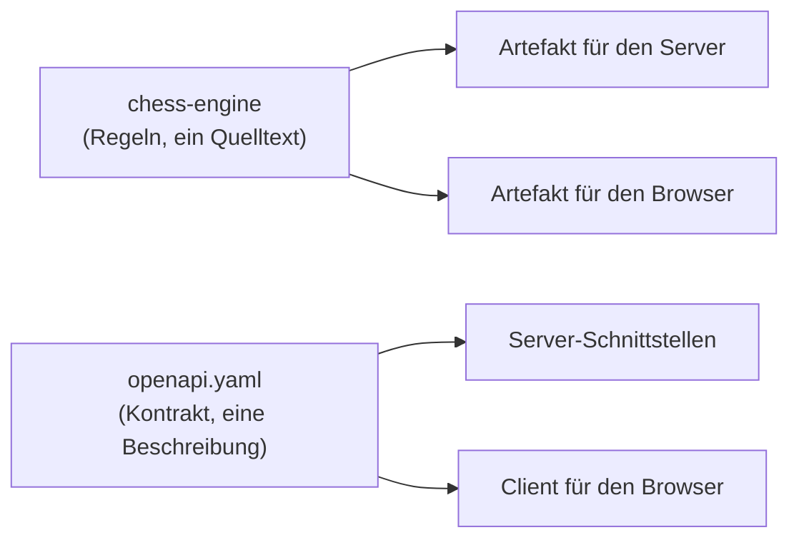

# Wenn zwei Programme dasselbe wissen müssen

## Das Problem

Zwei Programme laufen an verschiedenen Orten und müssen sich über dieselbe Sache einig sein. Über zwei Sachen sogar: **was erlaubt ist** — welcher Zug legal ist, wann eine Partie zu Ende ist — und **wie eine Nachricht aussieht**, die zwischen ihnen hin und her geht.

Der naheliegende Weg ist, sich einmal abzusprechen und danach zweimal zu bauen. Beide Seiten schreiben dieselbe Regel auf, jede in ihrer eigenen Sprache. Am ersten Tag ist das richtig, und am ersten Tag ist es auch billig — die zweite Fassung ist eine Stunde Arbeit.

Der Zerfall danach hat keinen Moment, an dem er sichtbar wäre. Jemand ändert eine Seite. Beide Seiten sind weiterhin in sich stimmig, beide Testläufe grün, beide Programme funktionieren. Der Widerspruch existiert nur **zwischen** ihnen, und dort schaut nichts hin. Er wird sichtbar, wenn die beiden aufeinandertreffen — also bei jemandem, der die Anwendung benutzt, und in einer Lage, die niemand nachstellen kann, weil sie von zwei Zuständen gleichzeitig abhängt.

Sorgfalt hilft dagegen nicht, und zwar nicht, weil Menschen unsorgfältig wären. Sie hilft nicht, weil sie voraussetzt, dass jemand sich in dem Moment der Änderung an den zweiten Ort **erinnert** — an einen Ort, der im Code vor ihm nicht vorkommt. Wer eine Kopie pflegen will, braucht keine Disziplin, sondern ein Gedächtnis, und Gedächtnisse sind das Erste, was in einem Projekt ausfällt.

Bleibt die Bewegung, die die ganze Lektion trägt: **Einigkeit aufhören zu verabreden und anfangen, sie abzuleiten.** Ein Ort hält die Wahrheit, die anderen entstehen aus ihm. Dann ist Auseinanderlaufen nicht unwahrscheinlich, sondern unmöglich — es gibt nichts, was auseinanderlaufen könnte.

Der Preis dafür steht im Rest dieser Lektion. Er ist ein **Schnitt**: eine Grenze, die irgendwo verlaufen muss, und die falsche Grenze kostet mehr als die Kopie, die sie ersetzt.

## Die Leiter

Sechs Stufen. Die Sprosse ist hier keine Testdatei, sondern ein Zustand der Architektur, und **diese Leiter wird nicht ausgeführt** — es gibt keinen Test, der einen Schnitt grün macht. Wo eine Stufe einem Ort im Repo entspricht, ist er verlinkt; nachprüfbar ist dann der Ort, nicht die Stufe. Die Unterscheidung ist wichtig genug, um sie zu benennen: Bei der Leiter zur [Anzeige](03-frontend-react-dom-tests.md) beweist der Build, dass jede Sprosse läuft. Hier beweist er nichts.

| Stufe | Neu dazu | Wo |
|---|---|---|
| 1 | Die Regel steht zweimal, in zwei Sprachen | — |
| 2 | Eine Fassung ändert sich; der Widerspruch entsteht, ohne dass etwas ihn meldet | — |
| 3 | Die Regel bekommt genau einen Ort — der muss in einer Sprache stehen, die beide Seiten erreichen | [chess-engine/](../../chess-engine/) |
| 4 | Aus dem einen Ort entstehen zwei Auslieferungen statt einer | [chess-engine/build.gradle.kts](../../chess-engine/build.gradle.kts) |
| 5 | Dieselbe Bewegung, angewandt auf die *Form* der Nachrichten statt auf die Regel | [docs/api/openapi.yaml](../api/openapi.yaml) |
| 6 | **Projektcode:** wo die beiden Schnitte im Build stehen | [settings.gradle.kts](../../settings.gradle.kts) · [pnpm-workspace.yaml](../../pnpm-workspace.yaml) |

**Stufe 1 und 2 — der Ausgangszustand, und er ist nicht dumm.** Zwei Fassungen einer Regel sind der Normalfall in fast jedem System aus mehr als einem Teil. Sie sind so verbreitet, weil Stufe 1 tatsächlich funktioniert: Beide Seiten sind schnell, unabhängig, in ihrer eigenen Sprache geschrieben, ohne Werkzeugkette dazwischen. Bezahlt wird erst auf Stufe 2, und dort bezahlt jemand anderes — der, der Monate später die dritte Fassung eines Sonderfalls vergisst.

**Stufe 3 — ein Ort, und sofort ein Problem.** Sobald die Regel nur noch einmal existieren soll, stellt sich die Frage, *wo*. Die Regel muss von zwei Seiten erreichbar sein, die verschiedene Sprachen sprechen und an verschiedenen Orten laufen. Damit ist die Wahl keine Geschmacksfrage mehr: Es kommt nur eine Sprache infrage, die beide Zielplattformen bedienen kann. Der Schnitt ist an dieser Stelle **nicht gewählt, sondern gefunden** — er lag schon da, als Grenze zwischen zwei Laufzeitumgebungen. Genau das ist es, was einen guten Modulschnitt ausmacht, und der Punkt kommt weiter unten wieder.

**Stufe 4 — ein Quelltext, zwei Artefakte.** Der eine Ort wird zweimal übersetzt: einmal in ein Format, das die Serverseite lädt, einmal in eines, das die Browserseite lädt. Was dabei erzeugt wird, ist zweierlei — aber es ist zweimal *dasselbe*, weil es aus einem Quelltext stammt. Dazu gehört ein unscheinbares Detail mit Folgen: Damit die zweite Seite die Typen nicht raten muss, werden Typbeschreibungen mitgeneriert ([`generateTypeScriptDefinitions()`](../../chess-engine/build.gradle.kts)). Das Wissen fließt über die Grenze, nicht nur die Funktion.

**Stufe 5 — dieselbe Bewegung, anderer Gegenstand.** Was für die Regel gilt, gilt für die Form der Nachrichten genauso: Eine Beschreibung, aus der beide Seiten entstehen, kann nicht zwischen den Seiten auseinanderlaufen. [openapi.yaml](../api/openapi.yaml) ist der Ort; woraus dort was gemacht wird und in welcher Reihenfolge, ist der Gegenstand der [nächsten Lektion](02-build-kette.md).

**Stufe 6 — die zwei Zeilen, an denen die Schnitte hängen.** In [settings.gradle.kts](../../settings.gradle.kts) steht, dass die Engine ein eigenständiger Build ist, der eingebunden und nicht einverleibt wird; in [pnpm-workspace.yaml](../../pnpm-workspace.yaml) steht dieselbe Beziehung für die Browserseite. Was in diesen Dateien sonst noch steht — Plugin-Versionen, Repositorylisten, der Katalog für die Lernbeispiele —, gehört nicht zum Lernziel dieser Lektion. **Die Leiter endet, wenn das Lernziel erschöpft ist, nicht, wenn die Datei erschöpft ist.**

### Die Gestalt, auf die das hinausläuft

Zwei Quellen, jede mit zwei Ausgängen — das ist die ganze Aussage, und sie bleibt richtig, wenn ein fünftes Modul dazukommt. Ein Bild, das *alle* Bausteine zählt, wäre am Tag danach falsch; deshalb steht hier eine Beziehung und kein Inventar.

## Warum nicht anders

**Dass alles in *einem* Repository liegt, ist in keinem ADR entschieden — es wird in [0001](../adr/0001-kotlin-multiplatform-chess-engine.md), [0006](../adr/0006-build-orchestration.md) und [0010](../adr/0010-deployment-cicd-infrastruktur.md) vorausgesetzt.** Das ist ein Befund dieser Lektion und kein Versäumnis ihres Autors: Getrennte Repositorien hätten hier eine echte Konsequenz, weil sie die Engine zwingen würden, veröffentlicht zu werden, bevor jemand sie benutzen kann — genau der Zwischenschritt, den [ADR-0006](../adr/0006-build-orchestration.md) für die eine Seite ausdrücklich abschafft. Die Entscheidung ist also gefallen und wirkt; aufgeschrieben ist sie nicht.

Was **entschieden** ist, ist die Wahl darunter — wie die geteilte Regel geteilt wird ([ADR-0001](../adr/0001-kotlin-multiplatform-chess-engine.md)):

- **Zwei Implementierungen, abgeglichen durch Sorgfalt.** Kostet keine Werkzeugkette und schiebt die gesamte Verlässlichkeit auf das Gedächtnis. Der Zustand aus Stufe 1 und 2.
- **Eine Implementierung, und die andere Seite fragt jedes Mal nach.** Ein echter Kandidat, nicht bloß eine Verlegenheit: Die Regel läuft nur an einem Ort, die zweite Seite ruft ihn auf. Bezahlt wird mit Wartezeit bei jeder einzelnen Interaktion und mit der Bedingung, dass die Verbindung steht — für ein Brett, das anzeigen will, welche Felder erlaubt sind, während jemand eine Figur hält, ist das die falsche Rechnung.
- **Eine Implementierung, zweimal ausgeliefert.** Der gewählte Weg. Beide Seiten rechnen selbst, mit demselben Code. Bezahlt wird mit einer Übersetzungsstufe im Build und mit der Verpflichtung, an der Grenze eine Form zu wählen, die beide Seiten verstehen ([ADR-0007](../adr/0007-jsexport-in-commonmain.md) entscheidet, wo diese Anpassung steht — die Lektion zur [Build-Kette](02-build-kette.md) zeigt, warum sie bis in die Typen durchschlägt).

Für den Kontrakt läuft dieselbe Achse noch einmal ab, und die Alternativen sind wörtlich dieselben: von Hand abgesprochen, zur Laufzeit erfragt, oder aus einer Beschreibung erzeugt ([ADR-0008](../adr/0008-openapi-first-codegen.md)).

Und eine Grenze, die dieses Repo **nicht** zieht, gehört mit hierher: Innerhalb des Backends gibt es keine Modulschnitte ([ADR-0013](../adr/0013-package-by-feature-backend.md)). Das ist keine Inkonsequenz, sondern dieselbe Regel von der anderen Seite — dazu der übernächste Abschnitt.

## Was davon überall gilt

**Zwei Orte, die dasselbe wissen müssen, sind eine Verabredung. Ein Ort, aus dem beide entstehen, ist ein Mechanismus.** Verabredungen halten, solange sich jemand erinnert; Mechanismen halten, solange sie laufen. Der Unterschied zeigt sich nie am guten Tag, sondern an dem, an dem der Erinnernde nicht da ist.

Daraus folgt eine Unterscheidung, die weit über Architektur hinausreicht: **Erzeugte Doppelung ist keine Doppelung.** Dieselbe Information an zwei Orten ist unschädlich, solange der zweite Ort aus dem ersten *fällt* und niemand ihn anfassen darf. Sie wird schädlich in dem Moment, in dem jemand sie pflegen muss. „Don't repeat yourself" ist deshalb schlecht formuliert — die Regel meint nicht Wiederholung, sie meint **gepflegte** Wiederholung.

Der Preis wird an einer anderen Stelle fällig, und er ist echt: **Ein erzeugtes Artefakt darf man nicht mehr bearbeiten.** Wer in den generierten Code hineinschreibt, hat die Ableitung zerbrochen und die Kopie zurückgeholt — nur diesmal unsichtbar, weil sie aussieht wie ein Ergebnis. Deshalb steht in diesem Repo ein Verbot darauf, und deshalb sind die betroffenen Verzeichnisse nicht versioniert: Was man nicht editieren darf, gibt man am besten gar nicht erst in die Hand.

Und die zweite Hälfte der Lektion, die man leicht überliest, weil sie unspektakulär klingt: **Ein Schnitt lohnt sich dort, wo ohnehin schon eine Grenze verläuft.** In diesem Fall ist es eine Laufzeitgrenze — Server hier, Browser dort. Diese Grenze existiert, ob man sie im Bauplan nachzeichnet oder nicht; ein Modul entlang von ihr macht sichtbar, was ohnehin gilt. Ein Schnitt an einer *frei gewählten* Stelle erzeugt dagegen erst die Grenze, die er dann verwaltet: eigene Versionierung, eigener Build, eigene Veröffentlichung, eigene Fassaden — für eine Trennung, die niemand erzwungen hat. Deshalb ist es kein Widerspruch, dass dasselbe Projekt die Engine herausschneidet und das Backend nicht weiter unterteilt: Zwischen Server und Browser liegt eine Grenze, zwischen zwei Paketen desselben Prozesses liegt keine.

Der prüfbare Test dafür lautet: **Wird die Grenze auch dann noch erzwungen, wenn niemand sie durchsetzt?** Wenn ja, darf sie ein Modul werden. Wenn nein, ist sie eine Konvention und wird billiger als Konvention gehalten — als Paketname, als Namensregel, als Prüfung im Build.

Und ein Zusatz, der sich erst beim Nachbauen zeigt und den ersten Abschnitt dieser Lektion korrigiert: **Die zweite Fassung läuft nicht erst auseinander, wenn jemand sie ändert — sie ist von Anfang an anders.** Wer dieselbe Regel zweimal schreibt, schreibt sie in zwei Idiomen; die eine Fassung prüft auf ein Leerzeichen, die andere auf Leerraum, und beide meinen dasselbe, solange niemand einen Tabulator eingibt. Über gewöhnliche Eingaben sind sie sich vollkommen einig, und genau deshalb fällt es nie auf. Die Änderung an einer Seite ist damit nicht die Ursache des Zerfalls, sondern nur der Moment, in dem er groß genug wird, um jemandem aufzufallen. Das verschiebt die Frage: Es geht nicht darum, ob zwei Fassungen *heute übereinstimmen* — es geht darum, dass niemand sagen kann, worüber sie übereinstimmen.

### Transfer

- **Woran erkenne ich das Problem anderswo?** Immer dort, wo dieselbe Regel oder dieselbe Nachrichtenform an zwei Orten *geschrieben* steht. Der Verdacht ist begründet, sobald man auf die Frage „wo ist das definiert?" zwei Antworten bekommt — und er wird zur Gewissheit, wenn die Antwort lautet „an beiden Stellen, das muss man synchron halten".
- **Welche Alternativen gehören zur selben Problemklasse?** Zweimal schreiben und abgleichen · einmal schreiben und über eine Verbindung anfragen · einmal schreiben und für jede Seite ein Artefakt erzeugen. Drei Punkte auf einer Achse zwischen Unabhängigkeit und Verlässlichkeit, keine drei Meinungen.
- **Welche Randbedingung müsste sich ändern, damit ich anders entscheide?** Wenn die zweite Seite nicht selbst rechnen muss — wenn sie also nichts anzeigen soll, bevor die Antwort da ist —, wird das Anfragen zur besseren Wahl: eine Implementierung, keine Übersetzungsstufe, keine geteilte Sprache. Und wenn die beiden Seiten aufhören, dieselbe Wahrheit zu brauchen, entfällt der Schnitt ganz.

**Aufgabe.** Nimm eine Regel, die in fast jeder Anwendung zweimal existiert: die Gültigkeitsprüfung eines Passworts — Mindestlänge, mindestens eine Ziffer, keine führenden Leerzeichen. Schreibe sie in **einer** Datei zweimal als zwei unabhängige Funktionen, so wie sie in zwei Programmen entstünde, und lasse eine Liste von Testeingaben durch beide laufen, die meldet, wo sie sich unterscheiden. Ändere dann *eine* der beiden Fassungen so, wie es ein Mensch täte, der nur diese eine Seite vor sich hat — etwa Mindestlänge acht statt sechs. Schreibe die Sache anschließend so um, dass beide Prüfungen aus **einer** Beschreibung entstehen. **Fertig, wenn** du eine Eingabe nennen kannst, bei der die beiden ersten Fassungen auseinanderlaufen, und sagen kannst, warum diese Eingabe in der abgeleiteten Fassung gar nicht mehr entstehen kann.

Kein Projekt, keine Abhängigkeit, kein Buildskript: eine Datei in einem Kratzverzeichnis. Wenn dafür ein Gerüst nötig scheint, ist die Aufgabe zu groß geschnitten und wird kleiner geschnitten. Sie braucht insbesondere **kein** Multiplattform-Werkzeug — wenn doch, war das Werkzeug der Lerngegenstand und nicht das Verfahren.

### Selbsttest

- Warum ist eine Regel, die an zwei Orten steht, auch dann schon ein Fehler, wenn beide Orte heute übereinstimmen?
- Was unterscheidet eine Grenze, die man nachzeichnet, von einer, die man erfindet — und woran merkt man den Unterschied erst später?
- Welche Freiheit gibt man auf, wenn ein Artefakt erzeugt statt geschrieben wird, und warum ist gerade das der Punkt?

## Weiter

- [02 — Die Kette vom Kontrakt zum Artefakt](02-build-kette.md) — wie aus den beiden Quellen tatsächlich vier Artefakte werden, und in welcher Reihenfolge
- [Lernpfad](index.md) — die übrigen Lektionen
- [ADR-0001](../adr/0001-kotlin-multiplatform-chess-engine.md) — die Entscheidung für die geteilte Engine
- [ADR-0008](../adr/0008-openapi-first-codegen.md) — dieselbe Bewegung für den Kontrakt
- [ADR-0013](../adr/0013-package-by-feature-backend.md) — warum der Schnitt im Backend gerade *nicht* gezogen wird
