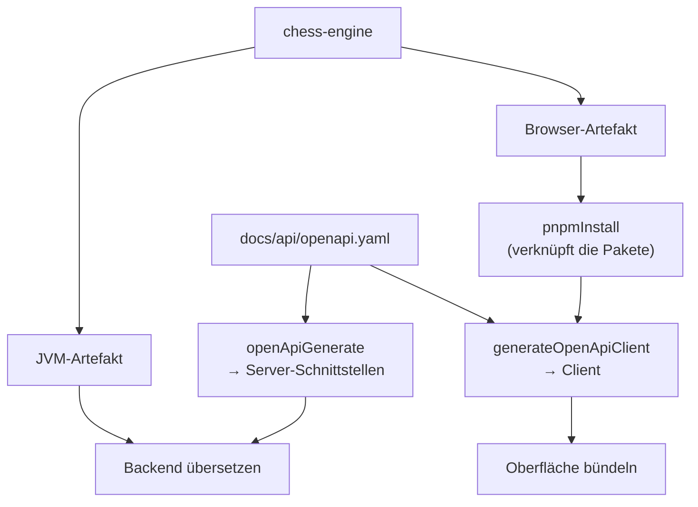

# Das Artefakt von gestern

## Das Problem

Sobald ein Bauteil aus einem anderen *entsteht*, gibt es eine Reihenfolge. Erst das eine, dann das andere — und wer es andersherum versucht, bekommt einen Fehler. Das klingt nach dem harmlosesten Problem der Softwaretechnik, und die naheliegende Antwort ist entsprechend: Man schreibt die Reihenfolge in die Anleitung und hält sich daran.

Die Reihenfolge ist aber gar nicht das Problem. Wer sie verletzt, merkt es sofort — es fehlt etwas, nichts baut, der Fehler zeigt auf die richtige Stelle. Ärgerlich, aber ehrlich.

Das eigentliche Problem entsteht in dem Moment, in dem das erzeugte Bauteil vom letzten Mal **noch dasteht**. Jemand ändert die Quelle und baut das Erzeugte nicht neu. Jetzt fehlt nichts. Alles übersetzt, alle Prüfungen laufen durch, und sie laufen gegen den Stand von gestern. Der Fehler zeigt auf nichts, weil es keinen Fehler gibt — es gibt nur eine Antwort auf eine veraltete Frage.

Das ist wieder die Gestalt aus der [ersten Lektion](01-architektur-und-schnittfuehrung.md), nur in der Zeit statt im Raum: **eine zweite Wahrheit, diesmal eine ältere.** Und sie ist schlimmer als die räumliche, weil sie sich versteckt. Sie verschwindet, sobald jemand alles einmal von vorn baut — also spätestens dann, wenn ein anderer Mensch das Projekt zum ersten Mal auscheckt und feststellt, dass etwas nicht stimmt, das bei allen anderen seit Wochen funktioniert.

Dagegen hilft nur, der Reihenfolge ihre Freiwilligkeit zu nehmen. Nicht: *erst dies, dann das*. Sondern: **dieses Bauteil kann gar nicht entstehen, bevor jenes aktuell ist** — und ob es aktuell ist, entscheidet niemand nach Gefühl, sondern ein Vergleich zwischen dem, was hineingeht, und dem, was herauskam.

## Die Leiter

Sieben Stufen. **Diese Leiter wird nicht ausgeführt** — ihre Sprache wäre Gradle und Kotlin, und ein ausgeführtes Beispielpaket dafür gibt es in diesem Repo noch nicht ([ADR-0020](../adr/0020-lernkonzept.md) benennt den Auslöser, ab dem es entsteht). Was hier steht, ist gelesen und nicht gelaufen; der Unterschied wird benannt statt weggeredet. Die letzte Stufe ist echter Code und deshalb verlinkt.

| Stufe | Neu dazu | Wo |
|---|---|---|
| 1 | Zwei Bauteile, von Hand nacheinander gebaut | — |
| 2 | Der alte Stand des erzeugten Bauteils überlebt den nächsten Lauf | — |
| 3 | Die Reihenfolge steht als Abhängigkeit im Build statt in einer Anleitung | — |
| 4 | Der Vergleich von Eingaben gegen Ausgaben entscheidet, ob ein Schritt überhaupt läuft | — |
| 5 | Das fremde Bauteil wird eingebunden statt veröffentlicht | [settings.gradle.kts](../../settings.gradle.kts) |
| 6 | Die Kette überschreitet die Sprachgrenze: ein zweites Build-System hängt am ersten | [build.gradle.kts](../../build.gradle.kts) |
| 7 | **Projektcode:** ein Aufruf, aus dem alles in der richtigen Reihenfolge fällt | [`buildAll`](../../build.gradle.kts) · [openApiGenerate](../../chesstopia-backend/build.gradle.kts) |

**Stufe 1 und 2 — der Zustand, den fast jedes Projekt einmal hatte.** Zwei Befehle in einer Anleitung, in der richtigen Reihenfolge notiert. Stufe 2 ist der Tag, an dem jemand nur den zweiten ausführt. Nichts bricht. Das ist das ganze Problem.

**Stufe 3 — Reihenfolge als Aussage statt als Bitte.** Ein Build-Werkzeug kennt Aufgaben und deren Abhängigkeiten. Sagt man ihm, dass Aufgabe B von A abhängt, ist die Reihenfolge kein Rat mehr: B *kann* nicht vor A laufen. Damit ist die Verletzung ausgeschlossen — aber Stufe 2 ist noch nicht gelöst, denn A darf immer noch beschließen, gar nichts zu tun.

**Stufe 4 — der Schritt, an dem die Sache kippt.** Damit ein Werkzeug entscheiden kann, ob ein Schritt nötig ist, muss der Schritt sagen, **wovon er abhängt und was er hinterlässt**. Erst dann ist „übersprungen" eine Aussage über Aktualität statt ein Ratespiel. Im Repo sieht man das an den Stellen, an denen ein Task seine Eingaben und Ausgaben deklariert — die Erzeugung aus dem Kontrakt nennt die Kontraktdatei als Eingabe und das Zielverzeichnis als Ausgabe. Ändert sich die Datei, läuft der Schritt; ändert sie sich nicht, ist das Überspringen bewiesen und nicht gehofft.

**Stufe 5 — der Zwischenschritt, den es nicht gibt.** Der klassische Weg, ein Bauteil aus einem anderen Build zu benutzen, führt über eine Ablage: bauen, veröffentlichen, im anderen Projekt beziehen. Das erzeugt genau die zweite Wahrheit aus Stufe 2, nur an einem dritten Ort — die Ablage hält eine Fassung, die niemand zu aktualisieren gezwungen ist. Der eingebundene Build ([`includeBuild`](../../settings.gradle.kts)) tauscht das gegen eine Ersetzung zur Bauzeit: Das Backend fragt nach einer Koordinate, und das Werkzeug legt ihm den lokalen Quellstand hin. **Es gibt keinen Zwischenstand, der veralten könnte, weil es keinen Zwischenstand gibt.**

**Stufe 6 — dieselbe Kette über eine Systemgrenze.** Auf der Browserseite steht ein anderes Paketwerkzeug, das nichts von Gradle weiß. Die Naht ist eine einzige Abhängigkeit: Bevor das Paketwerkzeug seine Verknüpfungen anlegt, muss das Browser-Artefakt der Engine existieren. Steht diese Abhängigkeit nicht da, entsteht Stufe 2 an der Sprachgrenze — und dort ist sie besonders unangenehm, weil die Fehlermeldung dann aus dem falschen Werkzeug kommt.

**Stufe 7 — ein Aufruf.** [`buildAll`](../../build.gradle.kts) hängt an allem, was oben steht: Engine für beide Zielplattformen, Erzeugung aus dem Kontrakt für beide Seiten, Backend, Oberfläche, Lernbeispiele. Der Wert liegt nicht in der Bequemlichkeit, sondern darin, dass es **keinen zweiten, kürzeren Weg gibt, der ein anderes Ergebnis liefert**. Was daneben in der Datei steht — die Verwaltung der Node-Version, einzelne Prüf-Tasks für die Pipeline —, gehört nicht zum Lernziel dieser Lektion.

### Die Kette

Der Graph zeigt, **wovon was abhängt** — nicht, was es alles gibt. Kommt ein weiterer Erzeugungsschritt dazu, bleibt jede Kante hier richtig.

### Wo die Grenze bis in die Typen durchschlägt

Ein Detail aus dieser Kette lohnt eine eigene Bemerkung, weil es zeigt, dass eine Plattformgrenze nicht bei den Artefakten aufhört. Die Engine markiert die Typen, die nach außen sollen, direkt im gemeinsamen Quelltext statt in einer eigenen Schicht für die Browserseite ([ADR-0007](../adr/0007-jsexport-in-commonmain.md)). Der Preis dafür steht in der Signatur: Ein exportierter Rückgabetyp ist [`Array<Move>`](../../chess-engine/src/commonMain/kotlin/io/chesstopia/engine/ChessEngine.kt) und nicht die Listenform, die man auf der Serverseite schreiben würde — weil nur die eine Form auf beiden Zielplattformen dasselbe bedeutet.

Damit wandert eine Eigenschaft der Browserseite in Code hinein, der von beiden benutzt wird. Das ist kein Fehler, sondern der sichtbare Teil der Rechnung: Wer eine Fassade einzieht, um ihn zu vermeiden, verdoppelt jeden exportierten Typ. Die Regel, die daraus im Repo geworden ist — die Umwandlung geschieht direkt am Aufruf, das fremde Format dringt nicht weiter nach innen —, ist die übliche Antwort auf diese Sorte Rechnung: **Die Grenze durchlassen, aber sie nicht wandern lassen.**

## Warum nicht anders

Hier gibt es, anders als in der [Lektion zur Anzeige](03-frontend-react-dom-tests.md), sehr wohl entschiedene Alternativen — [ADR-0006](../adr/0006-build-orchestration.md) für die Orchestrierung, [ADR-0008](../adr/0008-openapi-first-codegen.md) für die Erzeugung aus dem Kontrakt. Diese Lektion wiederholt ihre Begründung nicht; sie ordnet sie ein:

- **Veröffentlichen in eine lokale Ablage** — der verbreitetste Weg und der, gegen den die Entscheidung fiel. Er funktioniert und legt einen Zustand außerhalb des Projekts an, den niemand versioniert und den man vergessen kann zu erneuern.
- **Das fremde Projekt einverleiben** — ein Unterverzeichnis statt eines eigenen Builds. Spart die Einbindung und nimmt der Engine die Eigenschaft, für sich allein baubar zu sein. Genau die braucht sie, weil sie zwei verschiedene Zielplattformen bedient.
- **Erzeugung über ein Build-Plugin statt über einen direkten Aufruf des Erzeugers** ([ADR-0008](../adr/0008-openapi-first-codegen.md)) — bequemer in der Schreibweise, gekoppelt an die Version des Build-Werkzeugs. Die Entscheidung ging zugunsten des direkten Aufrufs, weil eine Kopplung weniger eine Fehlerquelle weniger ist.
- **Den erzeugten Code committen** — verlockend, weil dann jeder ihn sieht und keine Kette laufen muss. Erzeugt die zweite Wahrheit aus Stufe 2 dauerhaft und mit Segen: Ab dem ersten Mal, dass jemand hineinschreibt, ist die Quelle nicht mehr die Quelle. Deshalb liegen die Erzeugnisse hier außerhalb der Versionierung.

Und die Bedingung, die die generierten Schnittstellen streng macht: Sie enthalten [nur Schnittstellen und keine vorgefertigten Rümpfe](../../chesstopia-backend/build.gradle.kts). Damit lässt sich das Backend nicht übersetzen, solange ein Endpunkt aus dem Kontrakt nicht implementiert ist. **Eine Unvollständigkeit, die man wegdrücken kann, ist keine Prüfung.**

## Was davon überall gilt

**Ein Build ist ein Graph, keine Liste.** Wo eine Reihenfolge in einer Anleitung steht, ist sie eine Bitte an einen Menschen; wo sie als Abhängigkeit steht, ist sie eine Eigenschaft des Systems. Der Test dafür ist stumpf und funktioniert überall: *Kann ich die Schritte in der falschen Reihenfolge auslösen?* Wenn ja, ist die Reihenfolge nicht modelliert, sondern dokumentiert.

**Inkrementell und reproduzierbar sind dieselbe Eigenschaft.** Beides hängt daran, dass ein Schritt seine Eingaben und Ausgaben *benennt*. Wer sie nicht benennt, bekommt eine von zwei Krankheiten: entweder baut alles jedes Mal neu — teuer, aber ehrlich —, oder es wird zu wenig gebaut, und das ist die stille Variante aus dem ersten Abschnitt. **Wer überspringen will, muss beweisen, dass er darf.** Und der häufigste Fehler dabei ist derselbe wie in der Transferaufgabe unten: zu vergessen, dass der *Erzeuger* auch eine Eingabe ist.

**„Läuft lokal genauso wie in der Pipeline" ist eine Entwurfsvorgabe, keine glückliche Fügung.** Der Unterschied zwischen den beiden Umgebungen ist immer genau die Menge der Voraussetzungen, die nirgends deklariert sind — eine installierte Laufzeit, eine Umgebungsvariable, ein Artefakt, das seit Monaten im Heimatverzeichnis liegt. Deshalb ist die interessante Frage an eine Werkzeugkette nicht „funktioniert sie?", sondern **„was setzt sie voraus, das ich nicht sehe?"** Ein Projekt, dessen Build genau eine Voraussetzung hat, ist an dieser Stelle fertig gedacht.

**Eine halbrichtige Aktualitätsprüfung ist schlimmer als gar keine.** Der Vergleich „Quelle neuer als Ergebnis" fühlt sich beim Schreiben wie die Lösung an — er ist ein echter Vergleich, er stützt sich auf Tatsachen, und er funktioniert für den Fall, an den man dabei denkt. Er übersieht, dass der **Erzeuger selbst eine Eingabe ist**: Ändert sich die Vorschrift statt der Daten, bleibt die Quelle alt, das Ergebnis wird übersprungen und ist von diesem Moment an falsch. Ohne jede Prüfung hätte man an dieser Stelle zu viel gebaut und wäre richtig geblieben. Das ist die allgemeine Form: **Ein Mechanismus, der meistens stimmt, sammelt Vertrauen ein und gibt es genau dann nicht zurück, wenn man es braucht.** Wer überspringen will, zählt deshalb alles auf, wovon das Ergebnis abhängt — die Daten, die Vorschrift, und die Fassung des Werkzeugs, das beides verarbeitet.

**Und der Zwischenstand ist der Feind.** Jede Ablage zwischen zwei Schritten — eine Registry, ein Zwischenverzeichnis, ein Zwischenstand im Heimatverzeichnis — ist ein Ort, an dem eine alte Fassung überleben kann. Sie loszuwerden ist fast immer möglich und fast immer die bessere Wahl; wo sie bleiben muss, braucht sie einen Mechanismus, der sie erneuert, und nicht die Absicht, es zu tun.

### Transfer

- **Woran erkenne ich das Problem anderswo?** An jeder Anleitung, in der die Wörter „danach" oder „zuerst" stehen. Sie ist der Beleg, dass eine Abhängigkeit besteht, die das System nicht kennt. Und schärfer: an jedem erzeugten Artefakt, das man von Hand löschen muss, damit etwas wieder funktioniert.
- **Welche Alternativen gehören zur selben Problemklasse?** Reihenfolge in einer Anleitung · Reihenfolge im Skript, aber immer alles neu · Reihenfolge als Graph mit deklarierten Eingaben und Ausgaben. Die dritte ist die einzige, die gleichzeitig schnell und richtig sein kann; die ersten beiden opfern jeweils eines davon.
- **Welche Randbedingung müsste sich ändern, damit ich anders entscheide?** Wenn der erzeugende Schritt so teuer wird, dass er nicht bei jedem Bauen laufen kann — dann braucht man doch eine Ablage, aber mit einer Kennung, die aus den Eingaben berechnet ist, damit die alte Fassung nicht *stillschweigend* passt. Und wenn zwei Teile getrennt veröffentlicht werden müssen, weil sie verschiedene Empfänger haben, ist die Ablage kein Umweg mehr, sondern der Zweck.

**Aufgabe.** Bau eine winzige Erzeugung an einem fremden Gegenstand: eine Datei mit Konstanten, die aus einer kleinen Beschreibung entsteht — etwa eine Liste von Ländercodes in einer Datei, aus der eine zweite Datei mit Konstanten geschrieben wird. Schreibe zuerst die Fassung, die bei jedem Aufruf neu erzeugt. Dann rüste das Überspringen nach: erzeugen nur, wenn die Beschreibung neuer ist als das Ergebnis. Und jetzt der eigentliche Teil — **ändere den Erzeuger selbst** (etwa das Format der erzeugten Zeilen) und ruf ihn wieder auf. **Fertig, wenn** du benennen kannst, welche dritte Größe in die Überspringen-Entscheidung gehört und warum ihr Fehlen genau den Fehler aus dem ersten Abschnitt erzeugt.

Kein Build-Werkzeug, kein Projekt, keine Abhängigkeit: eine Datei in einem Kratzverzeichnis, die man zweimal aufruft. Wer dafür Gradle installiert, hat den Gegenstand verwechselt — das Verfahren ist die Aktualitätsentscheidung, nicht das Werkzeug, das sie zufällig eingebaut hat.

### Selbsttest

- Warum ist eine verletzte Reihenfolge das *harmlosere* Problem als eine eingehaltene?
- Was muss ein Schritt über sich aussagen, damit „nicht ausgeführt" eine Aussage über Aktualität ist statt eine Hoffnung?
- Warum ist eine Ablage zwischen zwei Bauschritten etwas anderes als ein Zwischenergebnis im selben Lauf — und was genau kann in ihr passieren?

## Weiter

- [01 — Wenn zwei Programme dasselbe wissen müssen](01-architektur-und-schnittfuehrung.md) — woher die beiden Quellen kommen, aus denen diese Kette läuft
- [04 — Was ein Rahmenwerk abnimmt](04-backend-spring-und-persistenz.md) — was am Ende der Kette entsteht und wie es innen aussieht
- [Lernpfad](index.md) — die übrigen Lektionen
- [ADR-0006](../adr/0006-build-orchestration.md) — die Orchestrierung über vier Build-Systeme
- [ADR-0007](../adr/0007-jsexport-in-commonmain.md) — warum die Markierung im gemeinsamen Quelltext steht
- [ADR-0008](../adr/0008-openapi-first-codegen.md) — Kontrakt zuerst, Erzeugung danach
