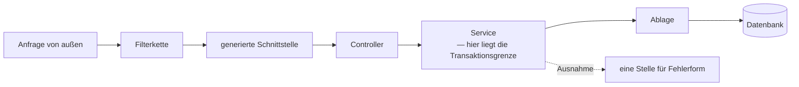

# Wenn das Drumherum größer ist als die Sache

## Das Problem

Die Sache ist klein. Eine Zahl um eins erhöhen — eine Zeile.

Damit diese Zeile von außen erreichbar wird, muss jemand auf einer Netzwerkschnittstelle warten, eine hereinkommende Anfrage in ihre Bestandteile zerlegen, entscheiden, welcher Code gemeint ist, das Ergebnis in ein Austauschformat gießen, einen Statuscode wählen und die Verbindung wieder schließen. Damit die Zahl einen Neustart überlebt, muss jemand eine Verbindung zu einem Speicher außerhalb des Prozesses aufbauen, sie wiederverwenden statt sie jedes Mal neu zu öffnen, eine Änderung als Ganzes gelingen oder als Ganzes scheitern lassen, und irgendwann muss die Ablageform sich ändern, ohne dass das Gespeicherte verlorengeht.

Das ist der Punkt, und er ist unangenehm: **Jede einzelne dieser Aufgaben ist gelöst, keine davon ist die Sache, und alle zusammen sind mehr Code als die Sache.** Wer sie selbst schreibt, schreibt sie nicht einmal, sondern in jedem Projekt wieder — und jedes Mal ein bisschen anders. Genau in diesem Drumherum sitzen die Fehler, die man nicht sieht: eine Verbindung, die nicht zurückgegeben wird; ein Fehlerfall, der einen internen Text nach außen gibt; eine Änderung, die zur Hälfte durchgeht.

Der naheliegende Ausweg ist, es einmal ordentlich selbst zu schreiben und wiederzuverwenden. Das ist kein falscher Gedanke — es ist genau der Gedanke, aus dem Rahmenwerke entstanden sind. Nur endet er, wenn man ihn allein zu Ende denkt, bei einem eigenen Rahmenwerk: unvollständig, ungetestet gegen fremde Fälle, und gepflegt von genau einer Person.

Die Bewegung dieser Lektion ist deshalb eine Abgabe. Nicht „ich schreibe weniger", sondern: **Ich gebe die Entscheidung ab, wann mein Code aufgerufen wird.** Was das einbringt und was es kostet, ist der eigentliche Gegenstand — denn abgegeben ist abgegeben, und beim ersten Fehler steht man vor einem Ablauf, den man nicht geschrieben hat.

## Die Leiter

Acht Stufen. **Diese Leiter wird nicht ausgeführt** — ihre Sprache wäre Java, und ein ausgeführtes Beispielpaket für die Serverseite gibt es in diesem Repo noch nicht; [ADR-0020](../adr/0020-lernkonzept.md) benennt den Auslöser, ab dem es entsteht. Gelesen und nicht gelaufen: der Unterschied wird benannt und nicht weggeredet. Die letzten Stufen sind echter Code und deshalb verlinkt.

| Stufe | Neu dazu | Wo |
|---|---|---|
| 1 | Ein Zähler im Speicher — eine Methode, sonst nichts | — |
| 2 | Er soll von außen erreichbar sein — jemand muss die Anfrage entgegennehmen | — |
| 3 | Das Zuhören wird abgegeben; übrig bleibt eine Methode mit einer Markierung | — |
| 4 | Die Abhängigkeiten werden nicht mehr geholt, sondern hereingereicht | — |
| 5 | Der Zähler überlebt den Neustart — sein Ort liegt außerhalb des Prozesses | [V1__create_counter.sql](../../chesstopia-backend/src/main/resources/db/migration/V1__create_counter.sql) |
| 6 | Die Ablageform bekommt eine Geschichte statt eines Zustands | [db/migration/](../../chesstopia-backend/src/main/resources/db/migration/) |
| 7 | Die Änderung bekommt eine Grenze: ganz oder gar nicht | [CounterService.java](../../chesstopia-backend/src/main/java/io/chesstopia/backend/counter/CounterService.java) |
| 8 | **Projektcode:** der Fehlerfall bekommt eine Form, an genau einer Stelle | [CounterController.java](../../chesstopia-backend/src/main/java/io/chesstopia/backend/counter/CounterController.java) · [GlobalExceptionHandler.java](../../chesstopia-backend/src/main/java/io/chesstopia/backend/error/GlobalExceptionHandler.java) |

**Stufe 1 und 2 — das Verhältnis wird sichtbar.** Die Methode ist fertig, bevor die Lektion anfängt. Alles Weitere ist Zugang: Wer ruft sie, woher weiß er, dass sie gemeint ist, und wie kommt ihr Ergebnis zurück.

**Stufe 3 — die Umkehrung.** Statt eines Programms, das wartet und dann *meine* Methode ruft, gibt es eine Methode mit einer Markierung, und etwas anderes findet sie. Das ist die eigentliche Bewegung, und sie hat einen Namen: Nicht mein Code ruft den Rahmen, der Rahmen ruft meinen Code. Der Gewinn ist nicht Tipparbeit, sondern dass alles, was mit *wann* und *wie oft* und *in welchem Faden* zu tun hat, aufhört, meine Angelegenheit zu sein.

**Stufe 4 — dieselbe Umkehrung, eine Ebene tiefer.** Ein Dienst, der eine Ablage braucht, holt sie sich nicht, sondern bekommt sie im Konstruktor gereicht. Das klingt nach einer Formalie und ist die Voraussetzung für alles Weitere: Nur was hereingereicht wird, kann im Test durch etwas anderes ersetzt werden, und nur was ersetzt werden kann, ist in Isolation prüfbar. Im Repo sieht man das an den Konstruktoren — sie nehmen entgegen, sie erzeugen nicht.

**Stufe 5 — der Zustand verlässt den Prozess.** Ab hier gibt es einen Ort, der einen Neustart überlebt, und damit sofort zwei neue Fragen: Wie kommt ein Objekt im Speicher mit einer Zeile in einer Tabelle zusammen, und wer entscheidet, wann geschrieben wird. Die Antwort des Rahmens ist eine Abbildung zwischen beidem; der Preis ist, dass zwischen dem Objekt und der Zeile eine Schicht steht, die eigene Regeln hat.

**Stufe 6 — die Ablageform bekommt eine Geschichte.** Das ist die Stufe, die man am ehesten überspringt, und die am teuersten nachzuholen ist. Ein Schema kann man aus den Objekten *erzeugen* lassen — bequem, und es funktioniert genau so lange, wie noch keine Daten drin sind, die man behalten will. Danach ist die Frage nicht mehr „wie soll die Tabelle aussehen", sondern „wie komme ich von der Tabelle, die es gibt, zu der, die ich will, ohne den Inhalt zu verlieren". Deshalb liegt hier eine **nummerierte Folge von Änderungsschritten** statt einer Beschreibung des Zielzustands: [V1__create_counter.sql](../../chesstopia-backend/src/main/resources/db/migration/V1__create_counter.sql) ist der erste Schritt, nicht das Schema.

**Stufe 7 — ganz oder gar nicht.** Lesen, verändern, schreiben ist im Nachhinein eine Operation, aber währenddessen sind es drei. Bricht etwas dazwischen ab, ist der Speicher in einem Zustand, den niemand vorgesehen hat. Die Markierung an [`increment`](../../chesstopia-backend/src/main/java/io/chesstopia/backend/counter/CounterService.java) sagt, wo diese Klammer beginnt und endet — und das ist keine technische Randnotiz, sondern eine Entwurfsentscheidung: **Die Transaktionsgrenze ist die Grenze, bis zu der man Konsistenz behauptet.**

**Stufe 8 — der Fehler ist Teil der Antwort.** Ein Aufrufer bekommt nicht nur die guten Fälle. Wenn jeder Endpunkt selbst entscheidet, wie ein Fehler aussieht, hat die Schnittstelle so viele Fehlerformate wie Endpunkte — und keines davon steht im Kontrakt. [GlobalExceptionHandler.java](../../chesstopia-backend/src/main/java/io/chesstopia/backend/error/GlobalExceptionHandler.java) macht daraus eine Stelle mit einem Format. Die Trennung darin ist der Teil, den man sich merken sollte: **Fehler, die der Aufrufer verursacht hat, werden nicht protokolliert; Fehler, die der Server verursacht hat, schon** — mit vollem Verlauf nach innen und einem nichtssagenden Satz nach außen. Wer es andersherum macht, füllt das Protokoll mit fremden Tippfehlern und verrät nebenbei den inneren Aufbau.

Und die Stelle, an der die [Kette aus der Build-Lektion](02-build-kette.md) hier ankommt: Der Controller implementiert eine Schnittstelle, die er nicht geschrieben hat ([`implements CounterApi`](../../chesstopia-backend/src/main/java/io/chesstopia/backend/counter/CounterController.java)). Er trägt keine eigene Pfadangabe — der Pfad steht im Kontrakt. Was in diesen Dateien sonst noch steht, gehört nicht zum Lernziel dieser Lektion.

### Der Weg einer Anfrage

Der Graph zeigt einen **Weg**, kein Inventar: Kommt ein weiteres Feature dazu, bleibt jede Kante richtig.

### Und der Test, der eine echte Datenbank braucht

In der [Lektion zur Anzeige](03-frontend-react-dom-tests.md) fehlt eine Testebene, weil eine Nachbildung kein Browser ist. Hier steht dasselbe Argument, aber die Entscheidung fiel andersherum: Die Prüfungen laufen nicht gegen einen leichtgewichtigen Ersatzspeicher, sondern gegen **dieselbe Datenbank wie im Betrieb**, nur eingebettet gestartet ([ADR-0012](../adr/0012-embedded-postgres-fuer-tests.md), sichtbar an [`provider: zonky`](../../chesstopia-backend/src/main/resources/application-test.yml)).

Der Grund ist derselbe wie dort und gilt allgemein: **Ein Ersatz glättet genau die Unterschiede, wegen derer man prüft.** Datentypen, Verhalten bei Nebenläufigkeit, die Frage, ob eine Änderungsdatei überhaupt durchläuft — das sind die Stellen, an denen ein Ersatzspeicher „grün" sagt und der Betrieb „nein". Bezahlt wird mit Startzeit, und das ist eine sichtbare, begrenzte Rechnung; die andere ist unsichtbar und offen.

Der Preis dieser Wahl ist eine Vorschrift, die man vergessen kann: Ohne die passende Markierung läuft ein solcher Test **gegen die echte Entwicklungsdatenbank**. Das steht als Regel in [CLAUDE.md](../../CLAUDE.md), weil es genau die Sorte Fehler ist, die man nicht bemerkt, solange nichts kaputtgeht.

## Warum nicht anders

Drei Entscheidungen tragen diese Lektion, und sie sind alle festgehalten. Diese Lektion wiederholt ihre Begründung nicht, sie ordnet sie ein:

- **Schnitt nach Feature statt nach Schicht** ([ADR-0013](../adr/0013-package-by-feature-backend.md)). Die verbreitete Alternative legt alle Controller zusammen, alle Dienste zusammen, alle Ablagen zusammen. Das sieht ordentlich aus und hat eine unangenehme Eigenschaft: Eine Änderung an *einem* fachlichen Ding fasst dann drei weit entfernte Orte an, und ein fachliches Ding ganz zu entfernen ist eine Suchaufgabe. Nach Feature geschnitten liegt zusammen, was zusammen geändert wird — und was zusammen verschwindet.
- **Kein Erzeuger für Standardrümpfe** ([ADR-0014](../adr/0014-minimaler-dependency-kern.md)). Werkzeuge, die Zugriffsmethoden oder Abbildungen zwischen Objekten zur Übersetzungszeit erzeugen, sparen echten Tipp-Aufwand. Sie kosten dafür etwas, das man erst beim ersten Fehler bemerkt: Der Code, den man liest, ist nicht der Code, der läuft. Hier ist beides von Hand geschrieben, weil moderne Sprachmittel den größten Teil der Ersparnis ohnehin liefern.
- **Der Ersatzspeicher im Test wird abgelehnt** ([ADR-0012](../adr/0012-embedded-postgres-fuer-tests.md)) — der Abschnitt oben.

Dazu eine Einstellung, die keine eigene Entscheidung ist, aber dieselbe Haltung zeigt: Der Zugriff auf die Ablage endet mit der Dienstschicht und reicht nicht bis in die Antwortgenerierung hinein ([`open-in-view: false`](../../chesstopia-backend/src/main/resources/application.yml)). Der Vorgabewert des Rahmens ist der bequeme; er lässt nachladen, wo längst niemand mehr damit rechnet. **Ein Rahmenwerk abzugeben heißt nicht, seine Vorgaben zu übernehmen.**

## Was davon überall gilt

**Ein Rahmenwerk nimmt keine Arbeit ab, sondern Kontrolle — und das ist der Handel.** Was man gewinnt: Alles, was mit *wann*, *wie oft* und *in welchem Faden* zu tun hat, ist gelöst und zwar von Leuten, die die Fälle gesehen haben, die man selbst noch nicht kennt. Was man verliert: Der eigene Code ist nicht mehr für sich lesbar. Die Reihenfolge steht nicht mehr im Programm, sondern in Regeln, die man kennen muss; ein Fehlerverlauf besteht zu neunzig Prozent aus fremden Bildern; und die Frage „warum passiert das jetzt?" wird von einer Lesefrage zu einer Wissensfrage.

Daraus folgt die praktische Regel: **Man muss nicht wissen, wie ein Rahmen es macht — man muss wissen, was er entscheidet.** Wann er meinen Code aufruft, was er für mich anlegt und wieder aufräumt, und wo seine Vorgaben etwas anderes wollen als ich. Alles Übrige darf undurchsichtig bleiben, bis es kaputtgeht.

**Zustand, der den Prozess überlebt, braucht eine Geschichte statt eines Zustands.** Solange man einen Speicher wegwerfen und neu aufbauen kann, ist die Beschreibung des Zielzustands genug. In dem Moment, in dem etwas drinsteht, das man nicht wiederherstellen kann, ist diese Möglichkeit für immer weg — und ab da ist die einzige belastbare Beschreibung eine **geordnete Folge von Schritten**, die man auf jeden vorhandenen Stand anwenden kann. Das gilt weit über Datenbanken hinaus: für Dateiformate, für Konfigurationsdateien, für Nachrichten zwischen Diensten, die verschiedene Fassungen sprechen. Wo Daten überleben, wird jede Änderung ein Wanderungsproblem.

Dazu gehört eine Falle, die beim Nachbauen sofort zuschnappt: **Die Fassungsnummer muss im Datensatz stehen, nicht im Programm.** Der verlockende Kurzschluss ist, die Fassung am Inhalt zu erkennen — „fehlt das Feld, ist der Satz alt". Das funktioniert genau so lange, bis ein Feld einen Wert bekommt, der wie seine Abwesenheit aussieht: Eine Einstellung, die jemand **bewusst abgewählt** hat, ist von einer, die es noch nie gab, nicht zu unterscheiden. Der Schritt läuft ein zweites Mal und überschreibt eine Entscheidung mit einer Voreinstellung. Deshalb trägt jeder Satz mit, wie weit er gewandert ist — und deshalb darf man einen Schritt niemals nachträglich *zwischen* zwei bestehende schieben, sondern nur hinten anhängen: Alles, was bereits gewandert ist, hat die alte Nummerierung schon gespeichert.

**Die Grenze, bis zu der etwas ganz oder gar nicht passiert, ist eine Entwurfsentscheidung.** Sie sieht aus wie eine Markierung an einer Methode und ist in Wahrheit die Antwort auf die Frage, welche Halbfertigkeit das System nie zeigen darf. Wer sie nicht bewusst zieht, hat sie trotzdem — nur an der Stelle, an der das Werkzeug sie zufällig setzt.

**Und Fehler gehören zum Kontrakt.** Eine Schnittstelle, die im guten Fall ein festes Format liefert und im schlechten irgendetwas, ist zur Hälfte undokumentiert; der Aufrufer schreibt dann Code gegen Zeichenketten, die niemand versprochen hat. Die zweite Hälfte davon ist die Protokollierungsregel: **Aufgezeichnet wird, was ich verursacht habe, nicht, was mir jemand geschickt hat.** Sonst ist das Protokoll die Ablage für fremde Fehler und in dem Moment unlesbar, in dem man es wirklich braucht.

### Transfer

- **Woran erkenne ich das Problem anderswo?** Am Verhältnis: Wenn der Code, der die Sache tut, im Verhältnis zum Drumherum verschwindet, ist die Frage fällig, welcher Teil davon in jedem Programm gleich aussieht. Und beim Zustand: Sobald irgendwo Daten liegen, die man nicht neu erzeugen kann, ist die nächste Formatänderung ein Wanderungsproblem — egal ob eine Datenbank beteiligt ist.
- **Welche Alternativen gehören zur selben Problemklasse?** Alles selbst schreiben · sich eine Sammlung kleiner Bibliotheken zusammenstellen und die Reihenfolge behalten · einen Rahmen nehmen und die Reihenfolge abgeben. Die mittlere Antwort wird gern übersehen und ist oft die richtige: Bibliotheken rufe *ich*, ein Rahmen ruft *mich*.
- **Welche Randbedingung müsste sich ändern, damit ich anders entscheide?** Wenn das Programm nur eine einzige Sorte Aufgabe hat und keinen überlebenden Zustand, ist der Rahmen teurer als das, was er abnimmt. Und wenn Startzeit oder Speicherverbrauch die harten Größen sind, kippt die Rechnung ebenfalls — dann bezahlt man an einer Stelle, die vorher niemanden interessiert hat.

**Aufgabe.** Nimm einen fremden Gegenstand mit überlebendem Zustand: die Einstellungen einer beliebigen kleinen Anwendung, als Objekt. Fassung 1 hat ein Feld `name`. Fassung 2 teilt es in `vorname` und `nachname`. Fassung 3 ergänzt eine Voreinstellung, die es vorher nicht gab. Schreibe in **einer** Datei eine geordnete Liste von Schritten — jeder Schritt eine Funktion von einer Fassung zur nächsten — und eine Ladefunktion, die auf ein beliebiges altes Objekt genau die Schritte anwendet, die ihm fehlen. Füttere sie dann mit einem Objekt der Fassung 1, einem der Fassung 2 und einem, das schon aktuell ist. **Fertig, wenn** du sagen kannst, warum die Fassungsnummer im Datensatz selbst stehen muss und nicht im Programm, und was passiert, wenn jemand einen Schritt nachträglich zwischen zwei bestehende einfügt.

Keine Datenbank, kein Rahmenwerk, keine Abhängigkeit: eine Datei in einem Kratzverzeichnis. Wer dafür etwas installiert, hat den Gegenstand verwechselt — das Verfahren ist die Wanderung, nicht das Werkzeug, das sie bei einer Datenbank zufällig übernimmt.

### Selbsttest

- Was genau gibt man an ein Rahmenwerk ab, und woran merkt man den Verlust zum ersten Mal?
- Warum reicht die Beschreibung eines Zielzustands für eine Ablageform nur so lange, bis etwas darin steht, das man behalten will?
- Warum werden Fehler, die der Aufrufer verschuldet hat, nicht protokolliert — und welchen Preis zahlt man, wenn man es doch tut?

## Weiter

- [02 — Das Artefakt von gestern](02-build-kette.md) — woher die Schnittstelle kommt, die der Controller implementiert
- [05 — Wenn es im Internet steht](05-sicherheit-und-betrieb.md) — was mit demselben Programm passiert, sobald Fremde es erreichen
- [Lernpfad](index.md) — die übrigen Lektionen
- [ADR-0012](../adr/0012-embedded-postgres-fuer-tests.md) — echte Datenbank im Test statt Ersatz
- [ADR-0013](../adr/0013-package-by-feature-backend.md) — Schnitt nach Feature
- [ADR-0014](../adr/0014-minimaler-dependency-kern.md) — jede Abhängigkeit ist eine Wette
