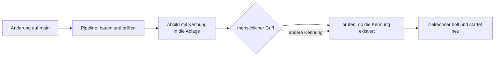

# Wenn es im Internet steht

## Das Problem

Bis eben lief das Programm auf dem eigenen Rechner. Es gab genau einen Benutzer, er war wohlgesonnen, jede Eingabe war gutgemeint, und wenn etwas kaputtging, ging es bei einem selbst kaputt.

Jetzt soll es an einem Ort laufen, den Fremde erreichen. Das sieht aus wie ein Umzug und ist keiner. **Es ist ein Wechsel des Gegenübers** — und in dem Moment, in dem er stattfindet, verwandelt sich jede Voreinstellung in eine Entscheidung. Welche Pfade offen sind, war vorher keine Frage; jetzt ist es eine, und wenn niemand sie beantwortet hat, hat der Vorgabewert sie beantwortet. Woher die Zugangsdaten kommen, war vorher egal, weil sie in einer Datei standen, die nur man selbst sah. Ob ein Neustart etwas zerstört, war vorher egal, weil man alles neu aufsetzen konnte.

Dazu kommt eine zweite Sache, die sich beim Umzug ändert und die man leicht übersieht: Aus **einem** Ding werden **mehrere**. Ein Rechner, der baut. Ein Rechner, der läuft. Ein Ort, an dem die fertigen Fassungen liegen. Etwas, das entscheidet, welche Fassung gerade dran ist. Und Daten, die keinem von ihnen gehören dürfen, weil sie alles überleben müssen.

Der naheliegende Weg ist, das nach und nach zu klären: erst online bringen, Sicherheit später, Konfiguration später, Trennung später. Genau daran scheitert es, und zwar an einer unangenehmen Asymmetrie. **Eine Schicht, die von Anfang an da ist und nichts tut, ist eine Zeile Konfiguration. Dieselbe Schicht später einzuziehen ist ein Umbau** — weil sich in der Zwischenzeit alles darauf verlassen hat, dass sie fehlt. Dasselbe gilt für Zugangsdaten: Ein Wert, der einmal in der Versionsgeschichte steht, steht dort für immer, auch wenn man ihn löscht.

Diese Lektion handelt deshalb weniger von Werkzeugen als von **Reihenfolgen**: davon, welche Entscheidungen man trifft, solange sie noch nichts kosten.

## Die Leiter

Acht Stufen. **Diese Leiter wird nicht ausgeführt.** Ihre Sprossen sind Zustände einer Betriebsumgebung — es gibt keinen Test, der einen Betriebszustand grün macht, und ein Beispielpaket dafür wäre eine Nachstellung, keine Prüfung. Was hier steht, ist gelesen und nicht gelaufen. Die letzten Stufen sind echter Code und deshalb verlinkt.

| Stufe | Neu dazu | Wo |
|---|---|---|
| 1 | Es läuft auf dem eigenen Rechner; jeder Aufrufer ist man selbst | — |
| 2 | Ein Fremder kann es erreichen — jeder offene Pfad wird zur Entscheidung | — |
| 3 | Die Entscheidung wird sichtbar aufgeschrieben, auch wenn sie „alles erlauben" lautet | [SecurityConfig.java](../../chesstopia-backend/src/main/java/io/chesstopia/backend/config/SecurityConfig.java) |
| 4 | Die Anwendung wird von ihrer Umgebung getrennt: überall dasselbe Abbild | — |
| 5 | Die Konfiguration bleibt im Repo, ihr Wert nicht | [application-prod.yml](../../chesstopia-backend/src/main/resources/application-prod.yml) |
| 6 | Gebaut wird einmal, an einem Ort — der Zielrechner baut nie | [ci.yml](../../.github/workflows/ci.yml) |
| 7 | Ausrollen heißt auf eine Fassung zeigen, nicht eine erzeugen | [deploy.yml](../../.github/workflows/deploy.yml) |
| 8 | **Projektcode:** der kostbare Zustand bekommt einen anderen Eigentümer als die Anwendung | [docker-compose.prod.yml](../../docker-compose.prod.yml) |

**Stufe 2 — was „erreichbar" bedeutet.** Ab hier gibt es zwei Fragen, die vorher zusammenfielen und die man auseinanderhalten muss: **Wer bist du** und **was darfst du**. Die erste ist eine Feststellung, die zweite eine Erlaubnis; ein System kann die erste beantworten und die zweite trotzdem falsch machen. Beides wird nicht im Kern erledigt, sondern in einer Reihe von Prüfstellen, die eine Anfrage passiert, bevor der eigene Code sie sieht. Diese Reihe existiert immer — die einzige Frage ist, ob sie jemand bewusst gefüllt hat.

**Stufe 3 — der Zustand, der wie ein Versäumnis aussieht.** In [SecurityConfig.java](../../chesstopia-backend/src/main/java/io/chesstopia/backend/config/SecurityConfig.java) steht [`anyRequest().permitAll()`](../../chesstopia-backend/src/main/java/io/chesstopia/backend/config/SecurityConfig.java) — alles ist erlaubt. Wer das liest, hält es für vergessen. Es ist das Gegenteil: Die Prüfkette liegt von Tag eins bereit und ist **ausdrücklich** auf durchlassen gestellt, statt gar nicht da zu sein ([ADR-0015](../adr/0015-security-von-tag-eins.md)).

Der Unterschied zwischen „es gibt keine Prüfung" und „die Prüfung sagt ja" ist der ganze Punkt dieser Stufe. Im ersten Fall gibt es nichts zu lesen, und das Thema fällt niemandem auf. Im zweiten steht eine Datei da, in der jemand eine Entscheidung getroffen hat, die man sehen und ändern kann — daneben die Stelle, an der die spätere Prüfung eingehängt wird. **Eine offene Tür mit einem Schild ist etwas anderes als eine fehlende Wand.**

**Stufe 4 — dasselbe Abbild überall.** Bis hierher hing das Programm an dem, was auf dem Rechner zufällig installiert war. Ein Abbild, das die Anwendung mitsamt ihrer Laufzeit einpackt, macht daraus etwas Transportables: derselbe Inhalt beim Bauen, beim Prüfen und im Betrieb. Der Unterschied zu einer vollständigen virtuellen Maschine ist dabei weniger wichtig als das, was beide erreichen wollen — dass „bei mir läuft es" aufhört, eine Aussage über *meinen Rechner* zu sein.

**Stufe 5 — Konfiguration und Geheimnis sind zwei Dinge.** Der Reflex ist, die Produktionskonfiguration aus dem Repo herauszuhalten. Das schützt die Zugangsdaten und kostet etwas, das erst später wehtut: Niemand kann mehr nachlesen, wie der Betrieb eigentlich eingestellt ist. Die Konfiguration lebt dann auf einer Maschine und im Kopf einer Person. [ADR-0017](../adr/0017-produktionskonfiguration-im-repo.md) trennt deshalb anders — **versioniert wird die Datei, verboten ist der Wert.** An jeder Stelle, an der ein Geheimnis stünde, steht ein Verweis nach außen, wie [`${POSTGRES_PASSWORD}`](../../chesstopia-backend/src/main/resources/application-prod.yml). Man sieht, *dass* es ein Passwort gibt und woher es kommt, aber nie, welches.

**Stufe 6 — gebaut wird an einem Ort.** Wenn der Zielrechner selbst baut, braucht er eine Werkzeugkette, Speicher für die Bauzeit und Netzzugang zu allem, was der Build zieht — und er tut das ausgerechnet, während er auch läuft. Deshalb baut die Pipeline und legt das Ergebnis in einer Ablage ab; der Zielrechner holt nur noch. Dass die Abbilder [erst nach allen drei Prüfläufen](../../.github/workflows/ci.yml) entstehen, ist die Bedingung, die den Rest erst erlaubt: In der Ablage soll nichts liegen, was nie geprüft wurde.

**Stufe 7 — ausrollen heißt zeigen.** Eine Fassung bekommt eine Kennung, die genau einem Stand entspricht, und das Ausrollen sagt nur noch, welche Kennung gelten soll. Damit sind „ausrollen" und „auf gestern zurückgehen" derselbe Vorgang mit anderem Wert — kein Sonderfall, kein zweiter Mechanismus, keine Bastelei unter Druck. Und die Prüfung davor gehört zur Lektion: [`docker manifest inspect`](../../.github/workflows/deploy.yml) stellt fest, ob es die verlangte Fassung überhaupt gibt, **bevor** irgendetwas angefasst wird. Ohne diesen Schritt hält man zuerst das Laufende an und stellt dann fest, dass es nichts zu starten gibt.

**Stufe 8 — die Eigentumsgrenze.** Nicht alles, was auf dem Zielrechner läuft, gehört derselben Instanz. Die Anwendung ist ersetzbar: Sie hat keinen Zustand, jede Fassung ist so gut wie die Kennung, aus der sie kam. Daneben liegt Zustand, der nicht ersetzbar ist — die Daten der Datenbank, die ausgestellten Zertifikate für die verschlüsselte Verbindung. Beides gehört in dieselbe Kategorie: **etwas, das man nicht neu erzeugen kann.** Deshalb fasst die Pipeline es nicht an. Sie verwaltet ausschließlich die zustandslosen Teile; die anderen liegen in getrennter Hand und teilen sich mit ihnen nur ein gemeinsames Netz ([`external: true`](../../docker-compose.prod.yml) sagt genau das: das Netz gehört nicht zu diesem Stapel). Damit ist es dem Ausrollen **strukturell unmöglich**, die Verschlüsselung oder die Datenbank abzuschießen — nicht unwahrscheinlich, unmöglich ([ADR-0010](../adr/0010-deployment-cicd-infrastruktur.md)).

Was daneben in diesen Dateien steht — Speichergrenzen, Protokollstufen, die Feinheiten der Netzwerkbenennung —, gehört nicht zum Lernziel dieser Lektion.

### Der Weg einer Änderung

Der gepunktete Pfeil ist der ganze Gewinn: Zurückgehen ist derselbe Weg mit einem anderen Wert.

## Warum nicht anders

- **Sicherheit später einbauen** ([ADR-0015](../adr/0015-security-von-tag-eins.md)). Die verbreitete Wahl, und sie ist nicht dumm — sie spart am Anfang echte Arbeit. Abgelehnt an der Asymmetrie aus dem ersten Abschnitt: Die Schicht später einzuziehen heißt, jede bereits gebaute Annahme über offene Pfade neu zu prüfen. Der Kostenunterschied zwischen „jetzt" und „später" ist hier größer als bei fast allem anderen.
- **Die Prüfschicht einfach weglassen statt sie auf durchlassen zu stellen.** Sieht gleich aus und ist es nicht: Der eine Zustand ist lesbar, der andere unsichtbar. Was man nicht sieht, kann man nicht wiedervorlegen.
- **Produktionskonfiguration außerhalb des Repos** ([ADR-0017](../adr/0017-produktionskonfiguration-im-repo.md)). Schützt zuverlässig und macht den Betrieb undurchschaubar. Die gewählte Trennung — Datei ja, Wert nein — hält beides, und sie ist deshalb belastbar, weil sie *maschinell geprüft* wird: Ein Literal an einer Geheimnisstelle bricht den Build. Eine Regel, die nur in einem Dokument steht, wäre genau hier die falsche Wahl.
- **Auf dem Zielrechner bauen.** Spart die Ablage und macht den laufenden Betrieb zum Nachbarn eines speicherhungrigen Vorgangs. [ADR-0010](../adr/0010-deployment-cicd-infrastruktur.md) trennt Bauen und Betreiben aus genau diesem Grund auf verschiedene Maschinen.
- **Eine bewegliche Kennung wie „neueste" statt einer festen.** Bequem und nimmt einem die Fähigkeit, zu sagen, was gerade läuft. Zurückgehen wird dann von einem Zeigen zu einer Rekonstruktion.
- **Ausrollen automatisch bei jeder Änderung auf `main`** ([ADR-0011](../adr/0011-migration-nach-github-actions.md)). Ein gangbarer Weg, hier bewusst nicht gewählt: Der menschliche Griff ist die Stelle, an der jemand entscheidet, ob *jetzt* ein guter Zeitpunkt ist — eine Frage, die keine Prüfung beantworten kann.

## Was davon überall gilt

**Nachrüsten kostet mehr als leer mitlaufen lassen.** Das ist die Regel, für die diese Lektion existiert. Sie gilt nicht für alles — die meisten Dinge baut man besser erst, wenn man sie braucht, und dieses Projekt tut das an vielen Stellen ausdrücklich. Sie gilt für die Sorte Schicht, auf deren **Abwesenheit** sich andere Teile stillschweigend einrichten: Rechteprüfung, Mandantentrennung, Nachvollziehbarkeit von Änderungen, Verschlüsselung im Transport. Bei denen ist die spätere Einführung kein Hinzufügen, sondern eine Migration von allem, was inzwischen darauf gewettet hat, dass es sie nicht gibt.

Der praktische Test dafür: **Wird die Sache später ein Umbau oder eine Ergänzung?** Ergänzungen darf man verschieben. Umbauten baut man leer mit — anwesend, konfiguriert, wirkungslos.

**Ein sichtbarer offener Zustand ist besser als ein unsichtbarer.** Die allgemeine Form ist: *Voreinstellungen sind Entscheidungen, die niemand getroffen hat.* Wer sie aufschreibt — auch dann, wenn er den Vorgabewert wählt —, verwandelt eine Leerstelle in etwas, das man lesen, wiedervorlegen und begründen kann. Das kostet eine Zeile und ist der billigste Kauf in dieser ganzen Lektion.

**Was man nicht wiederherstellen kann, gehört nicht in die Hand des Automaten.** Die brauchbare Sortierung ist nicht „wichtig gegen unwichtig", sondern **ersetzbar gegen unersetzlich**. Alles Ersetzbare darf eine Maschine jederzeit wegwerfen und neu hinstellen; alles Unersetzliche bekommt einen anderen Eigentümer, einen anderen Rhythmus und andere Berechtigungen. Wo die Grenze nicht gezogen ist, liegt sie faktisch trotzdem — nur bei dem, der zuletzt etwas ausgerollt hat.

**Und Konfiguration ist nicht dasselbe wie Geheimnis.** Der Reflex, beides gemeinsam wegzuschließen, verliert die eine Hälfte, die man dringend lesen können muss. Die tragfähige Trennung verläuft nicht zwischen Dateien, sondern **zwischen Struktur und Wert**: Die Struktur ist Dokumentation und gehört versioniert; der Wert ist ein Verweis nach außen. Das gilt überall dort, wo etwas gleichzeitig nachvollziehbar und vertraulich sein muss — und die Prüfung darauf gehört in einen Mechanismus, nicht in eine Verabredung, weil ein einmal eingecheckter Wert nicht zurückgeholt werden kann.

Der Grund, warum das Auflösen eine eigene Stufe braucht statt einer Textersetzung nebenbei, zeigt sich erst beim Nachbauen: **Ein nicht aufgelöster Verweis scheitert nicht dort, wo er steht.** Ein Lader, der die Datei einfach nimmt, meldet keinen Fehler — er reicht die Zeichenkette `${DB_PASSWORT}` als Passwort weiter, buchstäblich. Was danach passiert, ist eine abgelehnte Anmeldung an einer Datenbank, also eine Fehlermeldung an einer Stelle, die mit der Ursache nichts zu tun hat und drei Schichten entfernt liegt. Ein Lader, der beim Auflösen abbricht, meldet stattdessen *„die Umgebungsvariable fehlt"*, bevor irgendetwas startet. Das ist die allgemeine Form und sie gilt weit über Konfiguration hinaus: **Der Wert einer Prüfung bemisst sich nicht daran, ob sie den Fehler findet, sondern wie weit sie ihn von seiner Ursache entfernt meldet.**

### Transfer

- **Woran erkenne ich das Problem anderswo?** An jedem Übergang von „läuft bei mir" zu „ist erreichbar". Die nützliche Frage dabei ist nicht „ist es sicher?", sondern: **Welche Vorgabewerte gelten hier, und welche davon hat jemand bewusst gewählt?** Und bei den Daten: Was auf diesem Rechner kann ich nicht wiederherstellen, wenn ich ihn morgen neu aufsetze?
- **Welche Alternativen gehören zur selben Problemklasse?** Beim Schutz: nichts · anwesend und durchlassend · anwesend und prüfend. Beim Ausrollen: auf dem Ziel bauen · beweglich benanntes Abbild holen · fest benanntes Abbild holen. Beim Geheimnis: mit einchecken · alles aussperren · Struktur einchecken und Wert verweisen. Drei Achsen, auf denen jeweils die mittlere Antwort die teuerste ist, sobald etwas schiefgeht.
- **Welche Randbedingung müsste sich ändern, damit ich anders entscheide?** Wenn es keinen unersetzlichen Zustand gibt, verschwindet die Eigentumsgrenze — dann darf ein Automat wirklich alles anfassen. Und wenn eine Anwendung nie öffentlich erreichbar wird, sondern nur innerhalb eines geschlossenen Netzes läuft, verschiebt sich die Prüfkette nach außen, statt zu verschwinden; sie ist dann jemand anderes Problem und nicht keines.

**Aufgabe.** Nimm ein fremdes kleines Programm, das du schon hast — irgendeines, das eine Einstellung aus einer Datei liest. Schreibe in **einer** Datei zwei Fassungen des Ladens: eine, die den Wert direkt aus der Datei nimmt, und eine, die aus der Datei nur die *Struktur* nimmt und jeden als geheim markierten Wert aus der Umgebung auflöst — mit einem klaren Fehler, wenn die Umgebung ihn nicht hergibt. Lasse beide mit derselben Beispielkonfiguration laufen, einmal mit gesetzter und einmal mit fehlender Umgebungsvariable. **Fertig, wenn** du sagen kannst, welchen Fehler die zweite Fassung *früher* meldet als die erste, und warum genau das der Grund ist, sie zu wählen.

Kein Server, kein Behälterabbild, keine Ablage: eine Datei in einem Kratzverzeichnis und zwei Aufrufe. Wer dafür etwas ausrollt, hat den Gegenstand verwechselt — das Verfahren ist die Trennung von Struktur und Wert, nicht die Umgebung, in der sie zufällig wichtig wird.

### Selbsttest

- Warum ist eine Prüfkette, die alles durchlässt, etwas anderes als gar keine Prüfkette — und wem nützt der Unterschied?
- Welche Sortierung entscheidet, was ein Automat anfassen darf, und warum ist „wichtig" dafür die falsche Frage?
- Warum verliert man etwas, wenn man die Produktionskonfiguration vollständig aus dem Repo heraushält, obwohl das die Geheimnisse zuverlässig schützt?

## Weiter

- [04 — Wenn das Drumherum größer ist als die Sache](04-backend-spring-und-persistenz.md) — dasselbe Programm, von innen
- [Lernpfad](index.md) — die übrigen Lektionen
- [ADR-0015](../adr/0015-security-von-tag-eins.md) — Prüfkette von Tag eins, ausdrücklich durchlassend
- [ADR-0017](../adr/0017-produktionskonfiguration-im-repo.md) — verboten ist der Wert, nicht die Datei
- [ADR-0010](../adr/0010-deployment-cicd-infrastruktur.md) — die Eigentumsgrenze zwischen Automat und Zustand
- [ADR-0011](../adr/0011-migration-nach-github-actions.md) — der menschliche Griff beim Ausrollen
